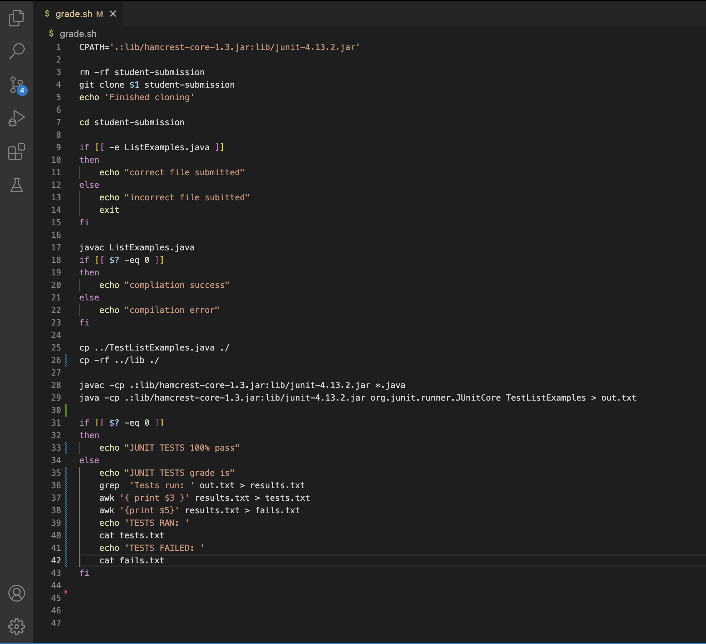

# Lab Report 4
Jesus Gonzalez - CSE 15L - A17425808 - March 13, 2023

---
**Lab 6** is my favorite lab. The purpose of this lab is to create a simple grading script. This grading script is meant to understand how a bash script can be used to grade files, similar to how gradescope grades coding asignments in Computer Science courses.

This is my `grade.sh` simple grading script.

1. I completed this grading script by first taking in a student submitted file. I did this by using the `git clone` command, to be able to clone the student repository. The student repository gets cloned by running the grading script as `bash grade.sh <STUDENT REPOSITORY URL>`. The student Repository URL is saved in the variable `$1`, so I can use `git clone $1 student-submission` to clone the student repository into a new directory called student-submission. ALSO, before cloning the command `rm -rf student-submission` needs to be ran to make sure that there are no previous student repositories present in the student-submission directory.
2. The next step is to check if the student has submitted the correct file. In order to do this, we first have to change directories into the student-submission directory using `cd student-submission`. We then use an if statement that uses the command `-e <file name>`. This command returns true if the path `<file name>` exists. So by running `if [[ -e ListExamples.java ]]`, if this is true `Correct File Submitted` is echoed in terminal. If this is false, therefore meaning the file does not exist in our present directory, meaning the wrong file has been submitted, `Incorrect File Submitted` is echoed and the bash script is ended.
3. The next step is to copy the tester file as well as the lib files into the same directory as the student submitted file, which would be the student-submission directory. To do this I used the commands `cp ../TestListExamples.java ./` and `cp -rf ../lib ./`.
4. The next step is to compile the students code and give them a message based on if the compliation was succesfull or not. To compile the student file i used the command `javac ListExamples.java`. I then used the variable `$?` which represents the most revcent error message and used an if statement to compare the recent error message with zero. This looks like `if [[ $? -eq 0 ]]`. If they are equal, this means the most recenet error message was 0, and therefore there was no error. "compliation success" is then echoed. If they are not equal, this means that the most recent error message is not zero and there was an error. "compilation error" is then echoed.
5. The Junit Tests are now run and a message based on the tests passed and failed is returned. The command `javac -cp .:lib/hamcrest-core-1.3.jar:lib/junit-4.13.2.jar *.java` is used to compile all the files in the directory. Then the command `java -cp .:lib/hamcrest-core-1.3.jar:lib/junit-4.13.2.jar org.junit.runner.JUnitCore TestListExamples > out.txt` to run the JunitTests and redirect the output into a file called out.txt. I then check the most recent error message using the `$?` variable. If there were no errors the message "JUNIT TESTS 100%g pass" is echoed. If there is an error by using `grep` and `awk` terminal commands I isolate the number of tests run, and the number of tests failed into their own txt files, and return a message saying the number of tests run compared to the number of tests failed.
